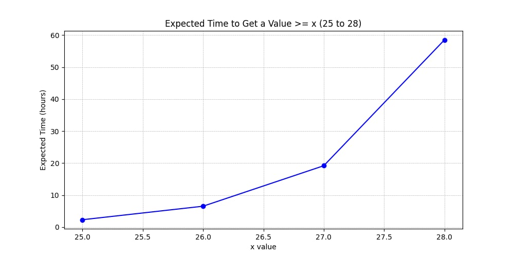
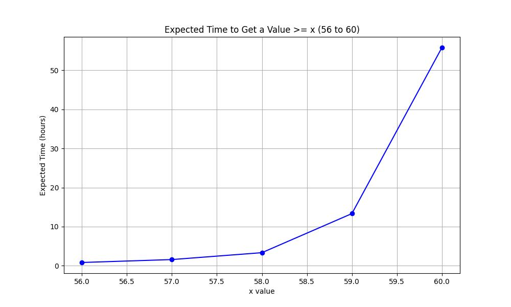

# Metin2-average-damage-calculator
This project calculates the average time it would take to get the desired average damage or skill
damage on a metin2 weapon.

It uses the exact same code metin2 server uses to calculate when a bonus change is used on a weapon with
average damage and skill damage.

The program takes as input the minimum desired average damage or skill damage and calculates how much time
it would take on average.

# Building
```sh
gcc main.c
```

# Usage
```sh
.\a.exe 45        # min average damage 45
.\a.exe 47 25     # min average damage 47 or min skill damage 25
.\a.exe 47 25 200 # same as above but do 200 iterations (better precission on time but program will run longer)
```

# Bonus

Average time to get skill damage >= x switching `250` bonusses per second (from my testing, it seems a skill damage > `28` is not possible).


Average time to get average damage >= x switching `250` bonuses per second
